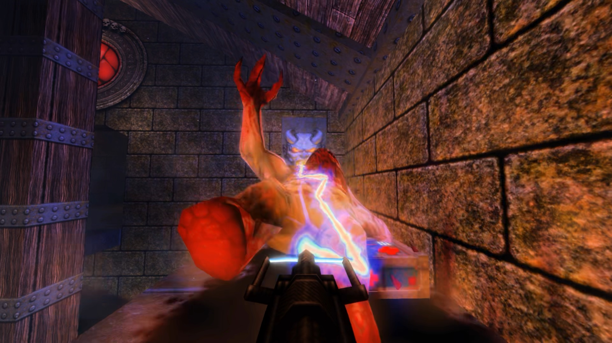
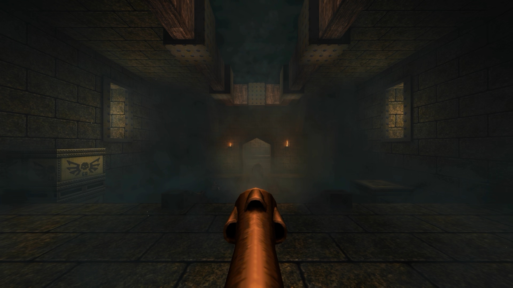

# MetalQuake

**Quake on Apple Silicon, rendered in Metal and lit by ray tracing.**

A fork of the [DarkPlaces](https://github.com/DarkPlacesEngine/darkplaces) engine with a
native Metal renderer, hardware ray-traced lighting and shadows, volumetric fog that the
level's own lights shine through, HDR (EDR) output and MetalFX upscaling — and a **Stock**
setting that puts the 1996 game back in one click.

<p>
  
  
</p>

**Watch:** [the thunderbolt (11 s)](https://github.com/sebcarley/MetalQuake/releases/download/v0.1.1/MetalQuake-thunderbolt.mp4) ·
[the fog hall (22 s)](https://github.com/sebcarley/MetalQuake/releases/download/v0.1.1/MetalQuake-fog-hall.mp4)
<sub>— captured a little brighter than it is played, so it survives video compression.</sub>

**[The field guide](https://sebcarley.github.io/MetalQuake/GUIDE.html)** ·
**[The manual](https://sebcarley.github.io/MetalQuake/MANUAL.html)** ·
**[Every setting](SETTINGS.md)** · **[How the Metal renderer was built](METAL.md)**

> Not affiliated with id Software or Bethesda. *Quake* is their trademark.
> **The game data is not included — you need to own Quake.**

## What it does

- **A Metal renderer**, written alongside DarkPlaces' OpenGL one and held to pixel parity
  with it; OpenGL remains as a fallback (`vid_renderer gl`).
- **Ray-traced lighting.** Every map light casts soft, contact-hardened shadows; one bounce
  of indirect light fills the corners; lava, torches and open sky are real emitters. The
  level's baked lightmaps are replaced outright, from the map's own light entities — no
  map needs recompiling and no `.rtlights` files are needed.
- **Volumetric fog** kept in three dimensions, settled on floors and in water, lit per
  step by the same lights — a shaft through a doorway has the shape of the doorway.
- **HDR output** on displays that support it, **MetalFX** temporal upscaling, and a
  morphological antialiasing pass after the upscale.
- **Seven quality tiers** on one menu row, from *Stock* (GLQuake as it was, through Metal)
  to *Ultimate*. Measured on an M5 at 1080p: Stock 320+ fps, Best ~100–110, Ultimate ~90.
- **Game extras, each behind its own switch**: a reworked thunderbolt and a ninth weapon
  (ball lightning), a Doom-style shotgun, bullet time, photo mode, a wave-survival horde
  mode with a director, room reverb and occlusion in the mixer. All off returns the 1996
  guns exactly.
- Works with the two 1997 mission packs, the re-release's *Dimension of the Past* and
  *Dimension of the Machine*, and **Arcane Dimensions**, if you have them.

## What you need

- A Mac with **Apple Silicon**. An **M3 or later** has hardware ray tracing and is what the
  settings were tuned on. On an M1 or M2 the ray tracing is emulated and has **not been
  measured** — start on *Options → M5 Quality → Fast* (or *Stock*) and work upwards, and
  please report what you get.
- **macOS 27 or later.**
- **Quake.** Any legitimate copy: Steam, GOG, or an original CD.

## Install

1. Download `MetalQuake-<date>.zip` from **[Releases](../../releases)** and unzip it
   anywhere. You get a `MetalQuake` folder holding `MetalQuake.app` and `packs/`. Keep the
   two together.
2. Copy **`pak0.pak`** and **`pak1.pak`** from the `id1` folder of your Quake into
   **`MetalQuake/packs/id1/`**.
3. Double-click `MetalQuake.app`. The first time, macOS says it was downloaded from the
   internet and asks whether to open it — click **Open**. The app is signed with a
   Developer ID and notarised by Apple, so there is no Terminal step.
   It starts on the **Best** tier. Too dark or bright on your
   display? *Options → Brightness and Gamma*. Too slow? *Options → M5 Quality*.

### What is included

`packs/m5` carries two things by other hands, each under its own terms and with its
licence text beside it: the **Quake Revitalization Project**'s map textures
(`QRP_map_textures_v.1.00.pk3`, credited as its licence asks), and the community-made
models and item boxes from **Authentic Model Improvements r26** (`progs/`, `maps/`,
`auth_mdl.txt` unmodified). The models that pack converted from the commercial Quake
remaster are **left out** — nobody but their owners may distribute them — and the engine
falls back to Quake's own for those. Delete the `.pk3` or `progs/` to play with the
originals, or pick the Stock tier, which ignores both.

### Optional extras (their owners' work, not included)

| Extra | Where it goes |
|---|---|
| The mission packs (`hipnotic`, `rogue`, and the re-release's `dopa`, `mg1`) | their folders into `packs/` |
| Arcane Dimensions | its `ad` folder into `packs/` |
| The soundtrack (`track02.ogg`, `track03.ogg` …) | `packs/id1/music/` |

## Building from source

```
brew install sdl2
make sdl-release -j8        # -> ./darkplaces-sdl
sh qc/build.sh              # -> m5/progs.dat   (needs fteqcc in tools/fteqcc/)
sh tests/smoke.sh           # headless checks
RELEASE_PUBLIC=1 sh release/make-release.sh     # -> the self-contained app + zip
```

Or open `QuakeM5.xcodeproj` (scheme **QuakeM5**) in Xcode. Run from the repository root
with `id1/` beside the binary. `METAL.md` is the renderer's design record; `test/README.md`
indexes the instruments (GL-vs-Metal pixel parity, the GL call-stream digest, the perf
sweep).

### What is ours and what is upstream

This is DarkPlaces with a fork on top, and most of the tree is DarkPlaces.

- **New files:** the Metal renderer and the ray tracer (`metal_backend.m`,
  `metal_textures.m`, `metal_fx.m`, `vid_metal.m`, `rt_metal.m`, `shader_msl.h`,
  `shader_density.h`, `rt_bluenoise.h`), the call-stream tracer (`dpcmdtrace.*`), the game
  code in `qc/m5*.qc`, and everything under `test/`, `tests/`, `release/` and `docs/`.
- **Modified:** about sixty of DarkPlaces' ~250 engine source files — chiefly `gl_rmain.c`,
  `r_lightning.c`, `menu.c`, `cl_screen.c`, `cl_particles.c`, `shader_glsl.h`,
  `cl_main.c`, `vid_sdl.c` and `gl_backend.c`. Fork changes are commented where they
  happen, and every user-visible one sits behind a cvar.
- **Everything else is unmodified upstream** and mostly unused here: the multiplayer
  cryptography (`crypto*.c`, written for Xonotic; it needs a library that is not bundled,
  so it is dormant), the iOS and WebAssembly projects, the Xonotic CI scripts, the Windows
  build notes.

## How it was made

MetalQuake was built by one person working with an AI coding assistant (Anthropic's
Claude, through Claude Code) over a summer: every feature was specified, judged by eye in
play and accepted or rejected by a human, and implemented and measured by the assistant.
The habit the project lives by is in the source comments — nothing is claimed to work
until it has been measured, and the measurements, including the ones that overturned a
plan, are written down next to the code.

## Licence and credits

GPL-2.0-or-later, like DarkPlaces — see [COPYING](COPYING). DarkPlaces is by
Ashley Rose Hale (LadyHavoc) and contributors ([CREDITS](CREDITS.md)); the QuakeC is built
on CleanFixedQuakeC; the fog's jitter table follows Wolfe et al., *Spatiotemporal Blue
Noise Masks* (EGSR 2022). The upstream README is kept as
[README-darkplaces.md](README-darkplaces.md).
